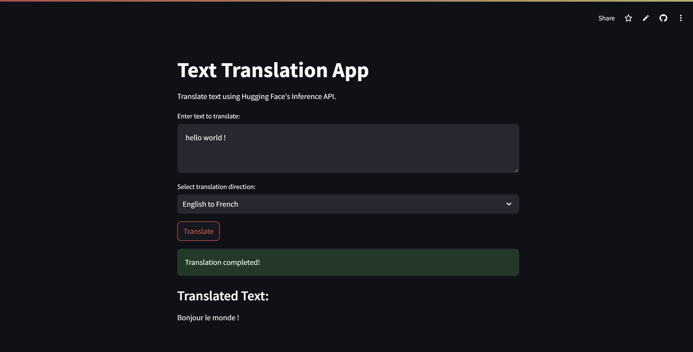
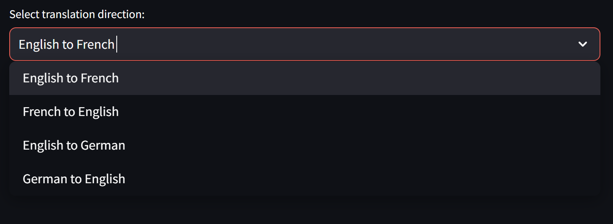

# 🌍 Multilingual Translation App

Welcome to the **Multilingual Translation App**! This application leverages Hugging Face's Inference API to provide seamless translation between multiple languages through a user-friendly Streamlit interface.

## 🚀 Features

- 🔄 **Dynamic Language Selection**: Choose source and target languages from a diverse set of options.
- ⚡ **Real-Time Translation**: Instantaneous translation results powered by Hugging Face's state-of-the-art models.
- 🖥️ **User-Friendly Interface**: Intuitive design for effortless navigation and interaction.

## 🖼️ Preview

### Main Interface


*The main interface of the Multilingual Translation App where users can enter text and select translation options.*

### Language Selection Screen


*Screen where users choose source and target languages for translation.*

## 🛠️ Setup and Deployment

Follow these steps to set up and deploy the application:

### 1. Clone the Repository

```bash
git clone https://github.com/ChrisVivasAI/translate-app
cd translation_app
```

### 2. Install Dependencies

Ensure you have Python 3.7 or higher installed. Then, install the required packages:

```bash
pip install -r requirements.txt
```

### 3. Obtain a Hugging Face API Token

1. Sign up or log in to your Hugging Face account.
2. Navigate to your API tokens page.
3. Create a new token with the necessary permissions.

### 4. Set Up Environment Variables

Create a `.env` file in the project root directory and add your Hugging Face API token:

```env
HUGGINGFACE_API_TOKEN=your_huggingface_api_token_here
```

*Note: Ensure the `.env` file is included in your `.gitignore` to prevent exposing sensitive information.*

### 5. Run the Application Locally

Start the Streamlit app:

```bash
streamlit run app.py
```

Access the app in your browser at [http://localhost:8501](http://localhost:8501).

### 6. Deploying to Streamlit Community Cloud

To deploy the app online:

1. Push your project to a GitHub repository.
2. Visit [Streamlit Community Cloud](https://streamlit.io/cloud).
3. Sign in with your GitHub account and select the repository.
4. Set the `HUGGINGFACE_API_TOKEN` in the app's Secrets section on Streamlit Community Cloud.
5. Deploy the app and share the generated link.

## 🤝 Contributing

Contributions are welcome! Feel free to fork the repository, make enhancements, and submit a pull request.

## 📄 License

This project is licensed under the MIT License. See the LICENSE file for details.

## 🙏 Acknowledgements

- Hugging Face for providing the Inference API and pre-trained models.
- Streamlit for the interactive web application framework.
